# Node-RED Challenge - Watson Visual Recognition - Pizza App

This exercise is divided in 4 steps, please note that Step 1&2 are independent than Steps 3&4 and 5 but an integration is needed at the end.

## A few words about Watson Visual Recognition technology
Watson Visual Recognition understands an image’s content out-of-the-box. The pre-trained models enable you to analyze images for objects, faces, colors, food, explicit content and other subjects for insights into your visual content.

Watson can also learn any new object, person, or attribute.

With only a few images, the computer vision service can learn any new object, person, or attribute such as identifying car type and damage to estimate repair costs. Train models effortlessly with Watson Studio — a free workspace where you can seamlessly create, evaluate, and manage your custom models.

In this exercise, you will go through a step-by-step process to use Watson Visual Recognition out-of-the-box and then you will create your own custom model using the integrated tooling available on IBM Cloud.

## Objective of the exercise

In the following lab, you will learn:

+ How to use the Watson Visual Recognition API
+ How to use the Watson Studio tools to create your own custom model
+ How to integrate the visual recognition technology in a web app application
+ Work on your creativity and project management skills

## Pre-Requisites

+ Get an [IBM Cloud Platform account in the US region](https://cllebrun.github.io/labs/0_Registration/), or use an existing account.

## Scenario

A Pizza Fast Food wants to provide to their customers a unique and specific online service.
As a developer, you are asked to create a "pizza checker app" so when the customer receives a pizza delivered at home and if while opening the pizza box he is not satisfied by the pizza condition, he can use this app in order to assess the problem using a visual recognition technology and report the problem to the Pizza Fast Food.
In order to do that you will need to create a Visual Recognition service. Then you will create and train a custom visual recognition model to recognise bad/good condition pizzas.

1. Your finale objective is to create a web application with a front end that will call your custom visual recognition model when the user upload a picture.
2. We also ask you to add new features/improvement of your choice to make this app unique.

What we expect from you to achieve today:

 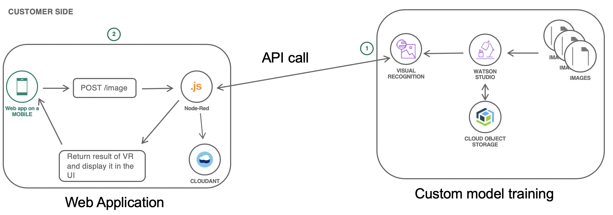

## Steps

1. [Testing Visual Recognition pre-trained models with the UI](#step-1---testing-visual-recognition-pre-trained-models-with-the-ui)
2. [Creating a Visual Recognition custom classifier](#step-2---creating-a-visual-recognition-custom-classifier)
3. [Creating a Node-RED application](#step-3---creating-a-node-red-application)
4. [Building your app using Visual Recognition](#step-4---building-your-app-using-visual-recognition)
5. [Free creative part](#step-5---free-creative-part)

# Step 1 - Testing Visual Recognition pre trained models with the UI

The first part of this lab will show you how to create a Visual Recognition Service, and use its tooling to test Watson provided models.

1. Login to IBM Cloud. https://cloud.ibm.com/login

2. Go to the IBM Cloud **Catalog** and select AI category.

 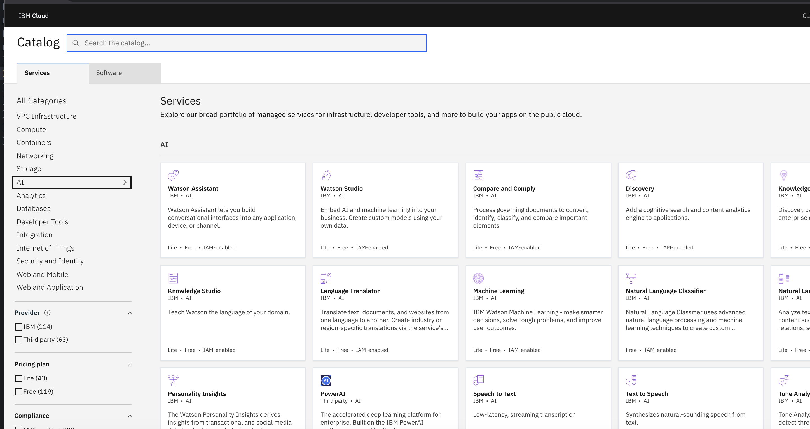

3. Then click the **Watson Studio** tile, then choose a name for your service (e.g. Watson Studio-pizza), in the **DALLAS** region, then click the Create button.

 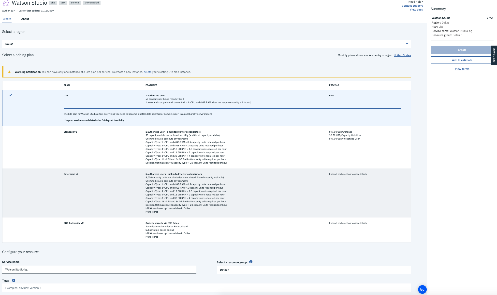
Watson Studio is the tool for building AI models in a collaborative fashion so you can provide a more democratic training process that reduces AI biases.

4. Click the Get Started button to open Watson Studio.
5. Click the Get Started button when prompt.

6. Click **Create a project**.
   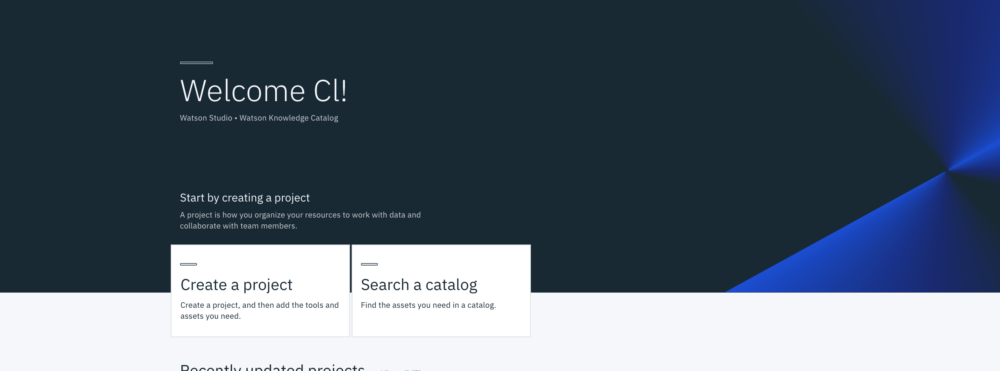

7. Create an **empty project**.
   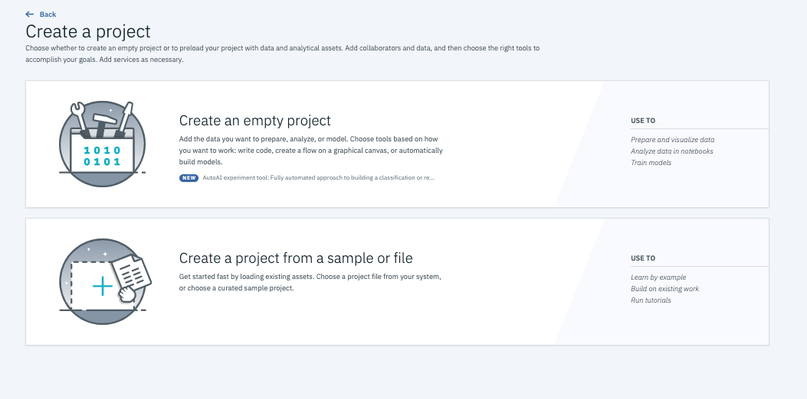

8. Enter a name for your project (e.g. My Pizza Quality Check) and a description if you like then click the **Create** button. **This project will create the needed Cloud Object Storage** in order to stare any data related to your project.
   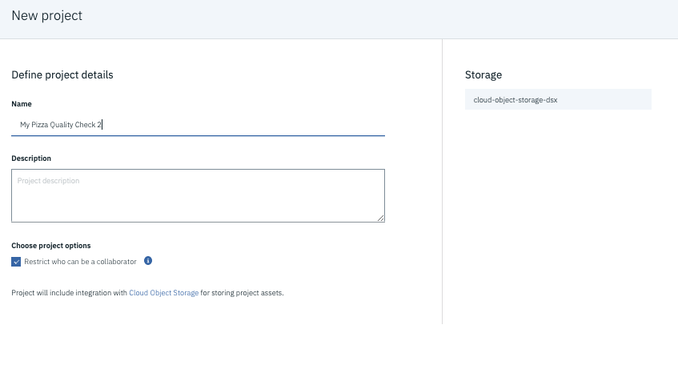

9. Once your project is created, on the top right, click on **+ Add to project**   
   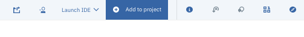

   And select **Visual Recognition** as asset type.
10. You need to provision a Visual Recognition service, click on the link to do it.
   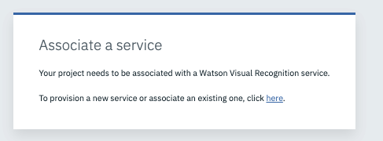

   Create the **new** service and make sure to chose the **DALLAS region**

   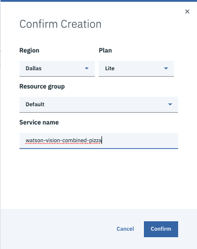

   Great! You have created a new machine learning project that you can collaborate on with others, upload data-sets, and create training models. Additionally, this project wizard has instantiated the Watson Visual Recognition service that is pre-trained on millions of consumer oriented images and can be used with no additional training (as we'll see below).

   However we will create a custom model below to teach Watson what insights are in your images that pre-trained visual recognition software just doesn't cover.

**Test the General model:**

Before creating a custom model, let's check out the General model that IBM has already trained on millions of images.

11. Click the Test button of the General model panel.
   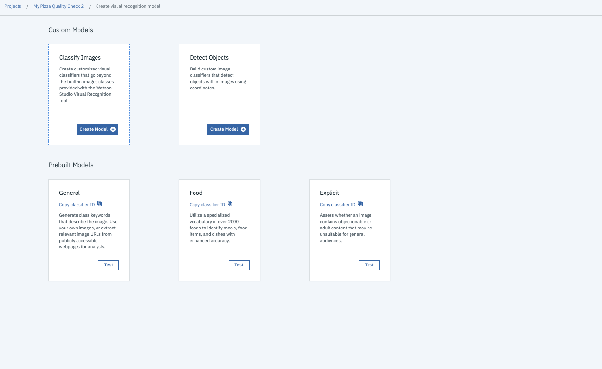
12. Click the Test tab of this model to upload an unlabeled image that Watson will examine to determine what insights can be gleaned from Watson's training of millions of images.
  

13. Locate your favourite image search tool to find test images, use your personal images or drag images from <a href="https://github.com/cllebrun/cllebrun.github.io/tree/master/labs/3.2%20Lab%20Watson%20-%20Watson%20Visual%20Recognition/Step1%20-%20Test%20Images.zip" download="step1-test-images.zip">step1-test-images</a> folder (You can download and extract the zip file on your laptop).

  

Notice it displays the confidence score (which is the statistical probability of this classification against other classifiers in this model).

Out of the box, Watson can tell you what kind of objects are in a photo even though these are your private photos that have not been indexed by a search engine nor contain labeled tags that tell Watson what the photo is about -- instead Watson can deduce this by comparing your photo against the millions of labeled photos that Watson has been trained on.

Yet still, these millions of photos are a drop in the bucket compared to how many photos are in the world and only come from the small 20% of consumer facing data, which leaves 80% of data behind your firewall -- and inside this data is your companies competitive edge.

Therefore, let's examine how easy it is to teach Watson something that consumer oriented AI doesn't do.

# Step 2 - Creating a Visual Recognition custom classifier

Objective : Teaching Watson New Tricks

The Visual Recognition service is trained by providing example images for each classification bucket -- the more examples you provide, the better the accuracy. After Watson has trained itself on your images, then it will classify a new image that it has never seen before and calculate how confident it is that it belongs to one of your classification types.

**Train your custom model:**

1. Click on the **watson visual recognition name** service link to return to the model choices.
  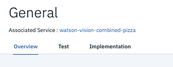

2. Click on the **Create Model** button on the Classify Images tile.
  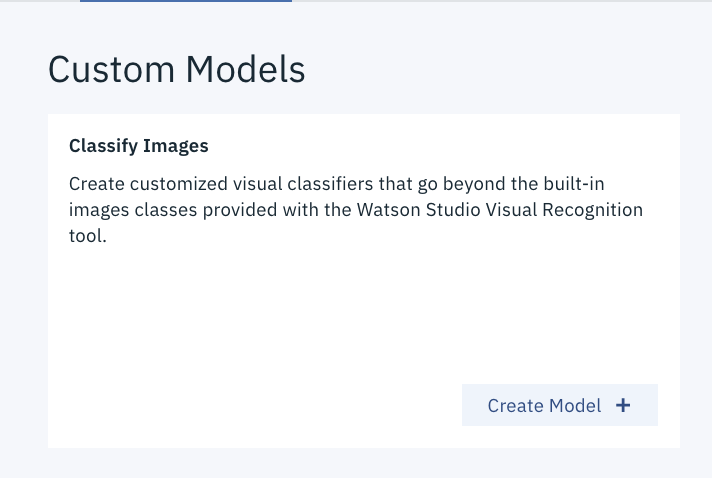

3. Rename your model "Default Custom Model" by "PizzaConditionModel"

4. You will now load images create your model classes. The pane to manage file upload is shown on the right side of your screen.
Click the Browse button to upload a zip file containing at least 10 photos (.jpg or .png) for good pizzas, at least 10 photos for bad pizzas, and 10 photos for not-pizzas. You can also drag and drop from your file explorer good_pizza_images.zip and bad_pizza_images.zip  in the <a href="https://github.com/cllebrun/cllebrun.github.io/tree/master/labs/3.2%20Lab%20Watson%20-%20Watson%20Visual%20Recognition/Step2%20-%20Training%20Set.zip" download="step2-training-set.zip">step2-training-set</a> folder (You can download and extract the zip file on your laptop).

  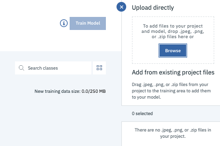

5. Rename the 2 classes created automatically : **GoodConditionPizza** and **BadConditionPizza**
6. Then open the **Negative** class. Browse and drag and drop the "not_pizza_images.zip" data set from the right of the screen to the class. Upon completion you will see image thumbnails for the class displayed in the tile.

7. Your model is ready to train, you can now click on the "Train Model" button and for your model to be trained. Even though it might seem like Watson is taking a long time, Watson set a world record for the fastest training of 7.5 million images in 7 hours versus the previous record taking 10 days (i.e. 34 times faster): http://fortune.com/2017/08/08/ibm-deep-learning-breakthrough/

This is really powerful! You can train Watson so it recognizes what you want, even if the most obvious object in a picture isn't what you want. Let's say you are in the tire business; most image recognition software (Watson included) will recognize an automobile image instead of the tires that you care about. Building your custom model will allow you to create a domain specific image recognition service.

**Test your custom model:**

Now that Watson has been trained on your specific images, let's test it out using the toolkit.

8. Click the Watson Visual Recognition service name link to return to the Visual Recognition service and scroll down until you see your newly trained PizzaConditionModel model.
9. Click the Test button, which will take you to your Overview tab showing you information about this model.

  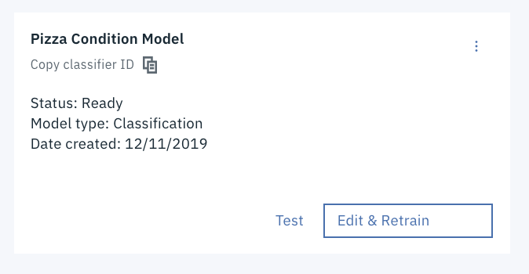

10. Click the Test tab and drop some pizza images onto the canvas to see how your custom model performs. The <a href="https://github.com/cllebrun/cllebrun.github.io/tree/master/labs/3.2%20Lab%20Watson%20-%20Watson%20Visual%20Recognition/Step2%20-%20Test%20images.zip" download="step2-test-images.zip">step2-test-images</a> folder  contains some test images you can use (You can download and extract the zip file on your laptop); or find some from your favourite search engine.

    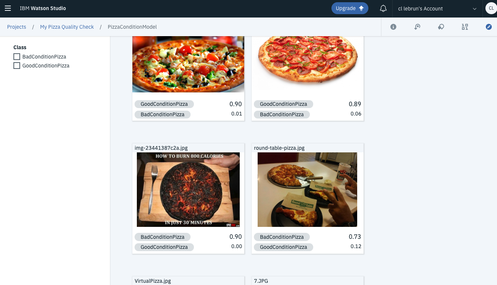

# Step 3 - Creating a Node-RED application

Node-RED is a visual tool for wiring the Internet of Things. It is easy to connect devices, data and api’s (services). It can also be used for other types of applications to quickly assemble flows of services. Node-RED is available as open source and has been implemented by the IBM Emerging Technology organization. Node-RED provides a browser-based flow editor that makes it easy to wire together flows using the wide range of nodes in the palette. Flows can be then deployed to the runtime in a single-click. While Node-Red is based on Node.js, JavaScript functions can be created within the editor using a rich text editor. A built-in library allows you to save useful functions, templates or flows for re-use.

A cloud version of Node-RED is a available on IBM Cloud but you can also deploy it as a stand alone Node.js application. Node-RED can not only be used for IoT applications, but it is a generic event-processing engine. For example, you can use it to listen to events from http, websockets, tcp, Twitter (and more!) and store this data in databases without having to program much, if at all. You can also use it to implement simple REST APIs. You can find many other sample flows on the Node-RED website.

1. Back on your IBM Cloud console, click Catalog in the menu bar on top

1. Select the Software tab, an look for **Node-RED App**

1. Select it and click on **Create App** (up and right)
It will create an instance of a Node-RED app (Node.js) and a Cloudant database.

1. Give a name to your app and for the Cloudant Database, select the **Dallas** region and **Lite** plan.

  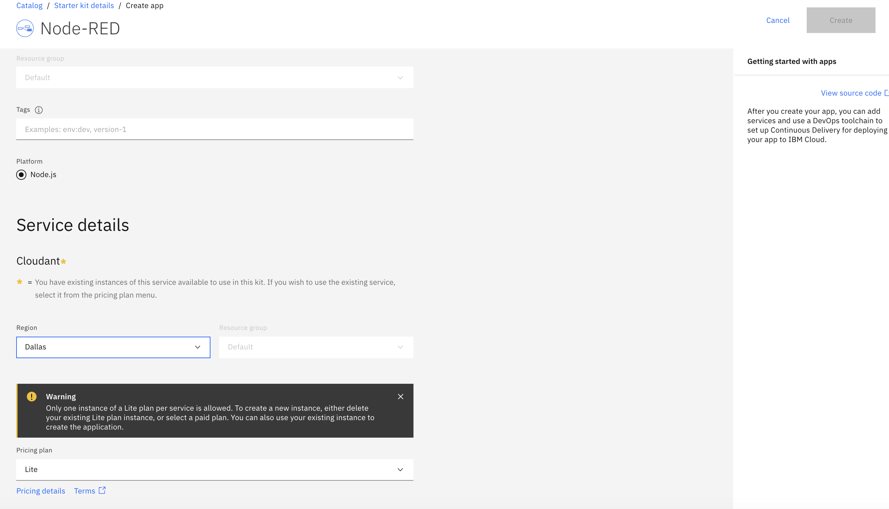

1. Clik Create. Now wait for few moments. You will know your app is created when you see the message on top right saying: “Success!...” This message will be there just for few seconds, then it will disappear

1. Now that your Node-RED app is created, deploy it to IBM Cloud by clicking on Deploy your app on bottom left
  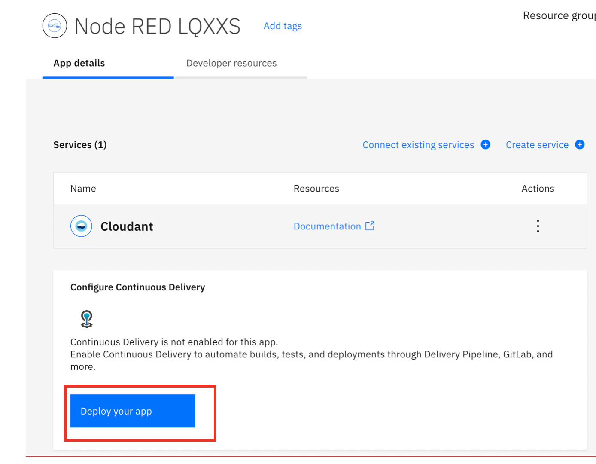

1. Create the API key for this app by clicking on New +.
  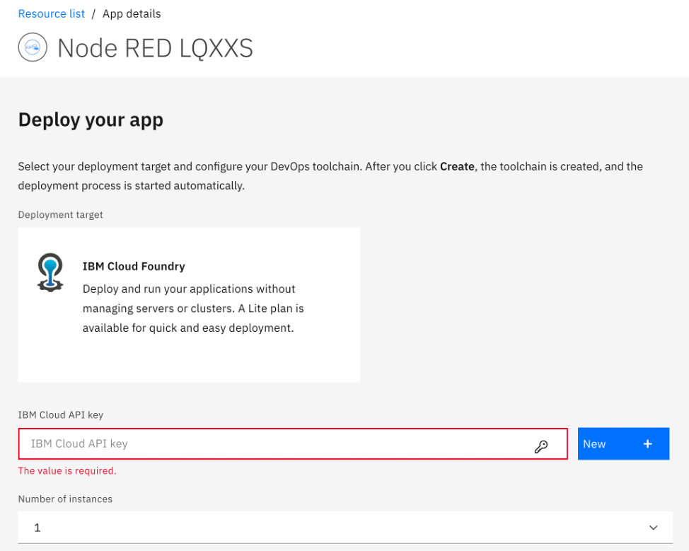

1. Click Ok, Click Create and wait for few minutes until the Node-RED app is deployed to IBM Cloud. Check the deployment status by clicking on **No stages detected**.

  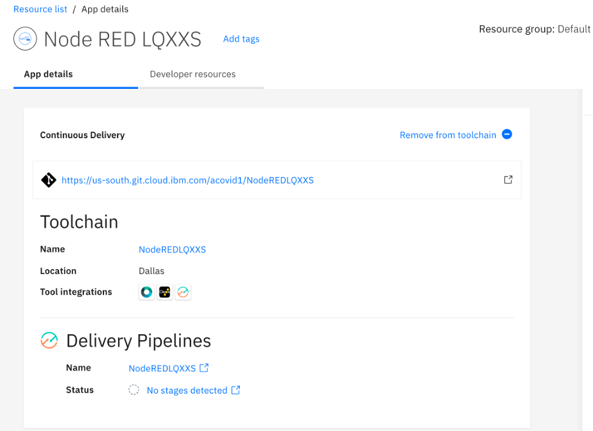

1. You will see two stages of your deployment – Build and Deploy. First the Build stage will run. Once Build is complete, it will show in stage PASSED and the Deploy stage will run

  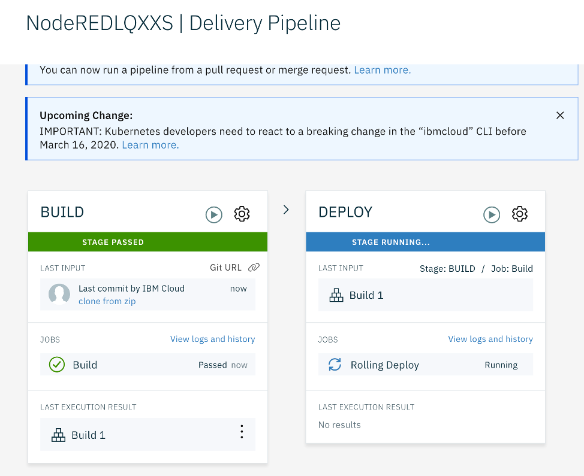

1. When both stages are in status PASSED, your application is ready

  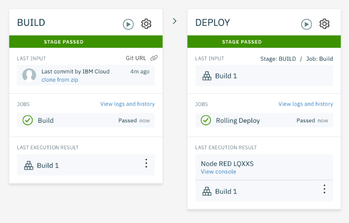

1. In your browser, go back to previous window which shows your app and open your Cloud dashboard by clicking on IBM Cloud in the menu on top and in the Resource summary pane, click on Apps:

  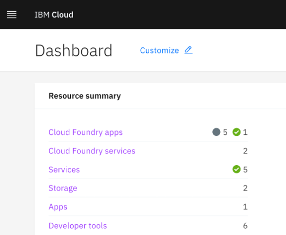

1. Click on your Node-RED app

1. Open your app by clicking on Visit App URL

  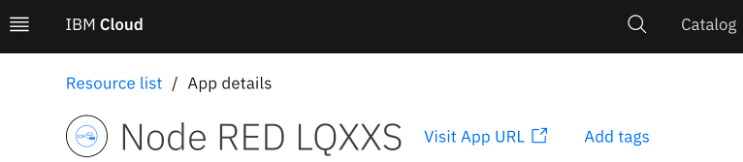

1. The welcome screen of your Node-RED app opens, click Next

  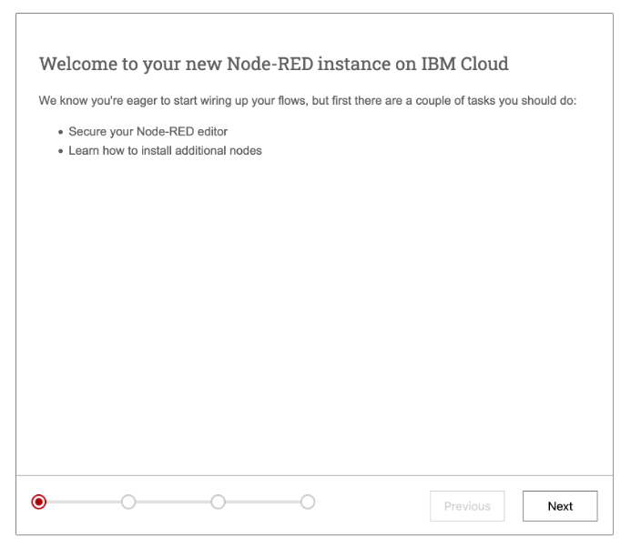

1. Click Next for each step of the service installation. When prompted for securing your editor, do secure it. Securing the editor is a good practice, but this is **very important** that you:
  - Remember you username/password and share it with your team
  - Allow the option "Allow anyone to view the editor, but not make any changes"

  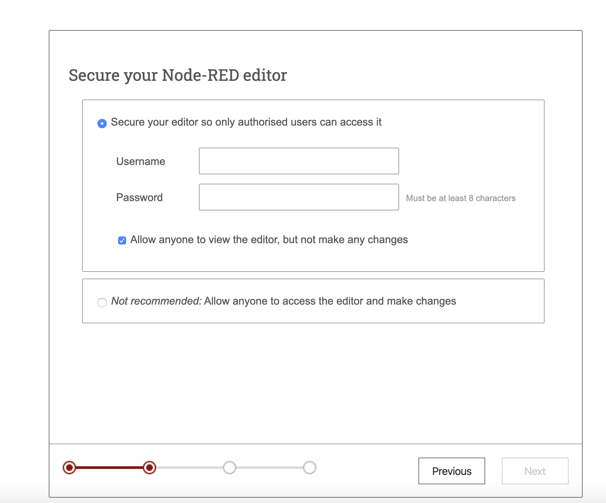

1. Click Next and Finish.

1. Your app is installed, start working with the app by clicking on the red button: **Go to your Node-Red flow editor**

Your Node-RED code editor is ready !

# Step 4 - Building your app using Visual Recognition

**How to create a simple flow with Visual Recognition**

6. Drag and drop the nodes **Inject**, **visual recognition** and **debug** on your Node-RED workspace. Wire them together.

  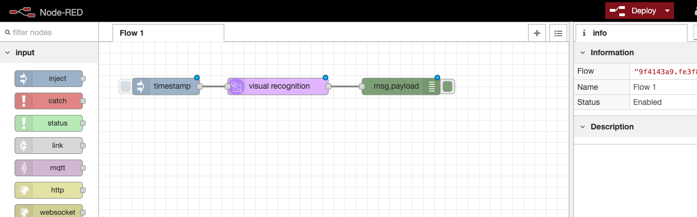

7. You need to configure the **visual recognition** node. Double click on it to open it, you need an **API Key** and to select the right **endpoint url**.

How can you can find these credentials from Visual Recognition Service created in Step 1?

- go to https://dataplatform.ibm.com/data/services?target=watson
- click on your visual recognition instance
- click on Credentials tab and View credentials or Create new credentials
- copy the apikey and url values

8. In Node-RED, paste the API Key value in the API Key field in your node. Same for the url endpoint.

9. Click Done.

  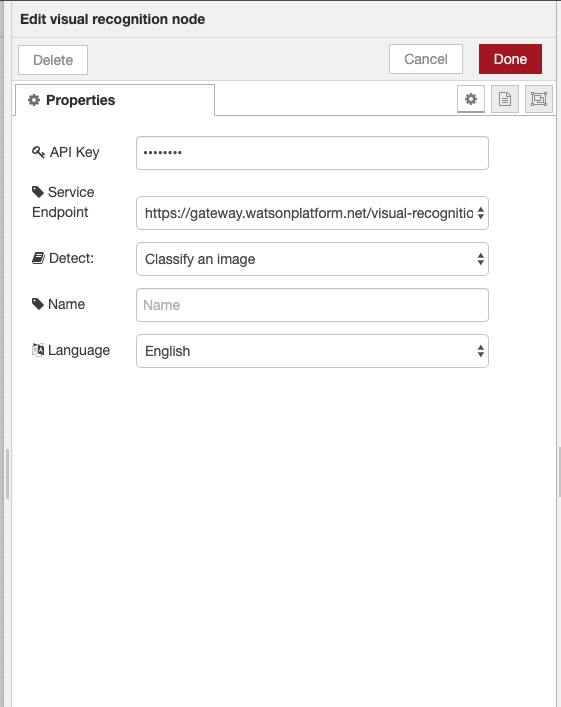

10. Open the **Inject** node and give any image URL as a string input to test your flow.
Click Done.

  

11. Open the **Debug** node, and select "complete msg object" as output. Click Done.

  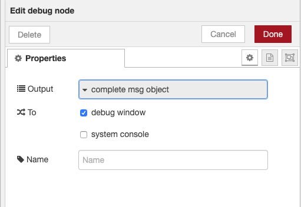

12. Deploy your flow by clicking on the red button on your Node-RED workspace (up and right).

  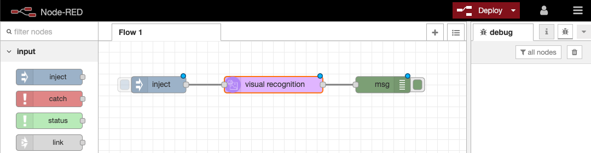

13. Click on the square next to the inject node. By doing so, it will set the payload part of the msg object as the image URL we want to send to Visual Recognition

    Node-RED is based on a msg object that "flows" from one node to another.
    - Each node can use all the msg object, or subpart of it to do its processing.
    - Each node must send back the msg object with updated content, or a new content.
    - The "main" part of the msg object is the msg.payload part
    - Watson Visual Recognition is loading the image from the msg.payload URL, and classifying the image with the specified classifier (here the default classifier)
    - Watson Visual Recognition node return its results in the msg.result object.
    - Debug node displays the msg object in the debug tab

14. Expand the msg object to discover the datastructure of msg.result

    You can see, it is the same as what we have seen in the previous lab, using the APIs.

    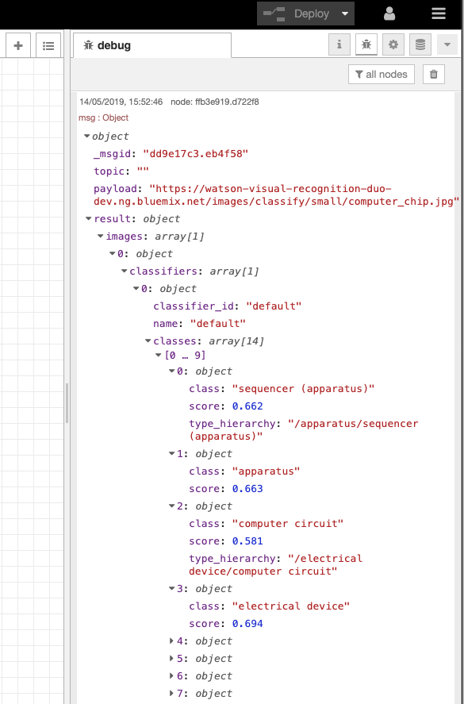

**How to create a flow using your custom model**

In this part, we will discover how to set the parameters of the Visual Recognition node

We will use the **Change** node to define some part of the msg object that will be used by Visual Recognition node.

  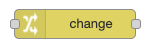

- msg.params["detect_mode"] : A setting of "classify" or "faces" indicating the visual recognition feature required. "Default" is "classify" (string) (Optional)
- msg.params["classifier_ids"] : A comma-separated list of the classifier IDs used to classify the images. "Default" is the classifier_id of the built-in classifier. (string) (Optional)
- msg.params["owners"] : A comma-separated list with the value(s) "IBM" and/or "me" to specify which classifiers to run. (string) (Optional)
- msg.params["threshold"] : A floating value (in string format) that specifies the minimum score a class must have to be displayed in the response (Optional)
- msg.params["accept_language"] : Specifies the language of the output class names. Can be 'en' (English as default), 'es' (Spanish), 'ar' (Arabic) or 'ja' (Japanese). Classes for which no translation is available are omitted. If specified, it overrides the language specified in the node configuration (Optional)

15. To start, we will create a new page in the Node-RED UI. Click on + near the info tab, to create a new page. It will create a Flow 2 tab with an empty canvas

 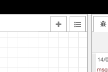

16. Insert on the canvas a **inject** node, a **change** node, a **visual recognition** node and a **debug** node like the following diagram

 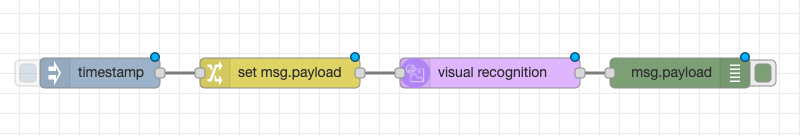

17. Configure the **visual recognition** node and the **debug** node the same way than for the Flow1.

18. With the change node, set msg.params["classifier_ids"] to your own classifier id (copied from Watson Studio): **copy classifier id**

 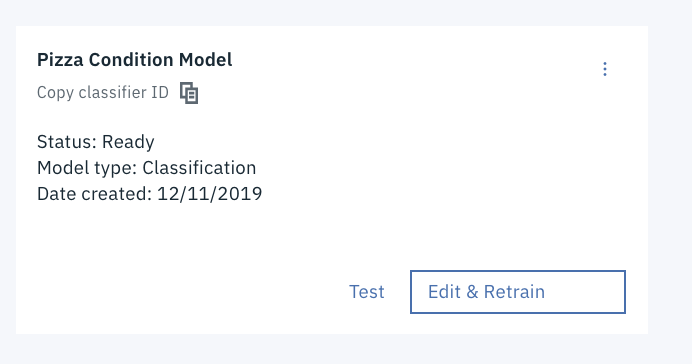

  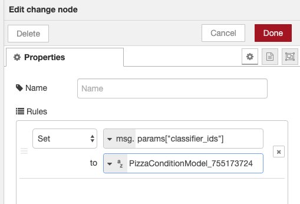

19. Click Done.
20. In the **inject** node, add a "Good Pizza" url : http://www.delonghi.com/Global/recipes/multifry/pizza_fresca.jpg (change the name of the node for better understanding of the flow)

  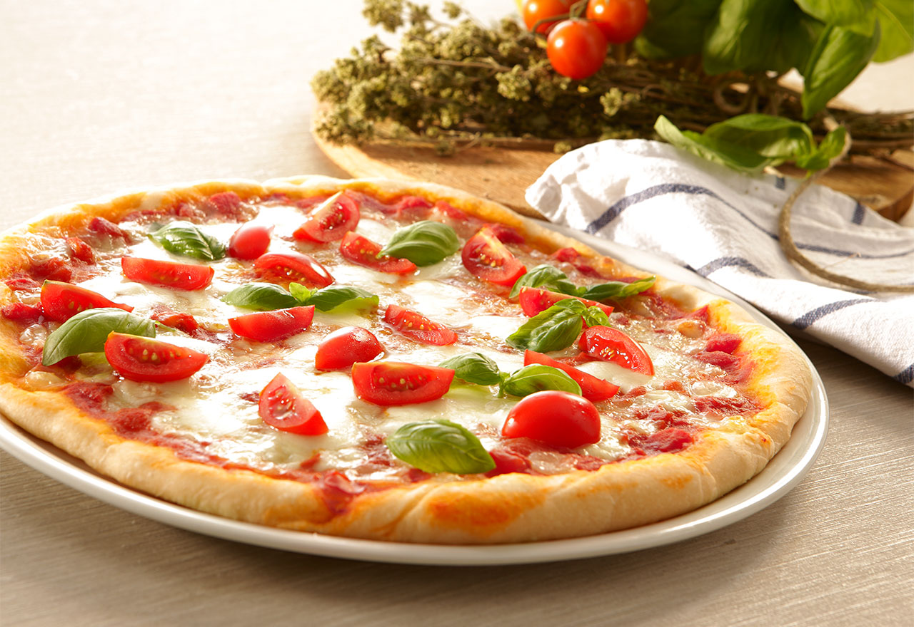
21. Add another **inject** node, add a "Bad Pizza" url : http://aws-cf.imdoc.fr/prod/photos/3/8/1/10732381/23441387/img-23441387c2a.jpg (change the name of the node for better understanding of the flow)

  

22. Wire the nodes together and Deploy (red button up and right). You can now test the two inputs:

  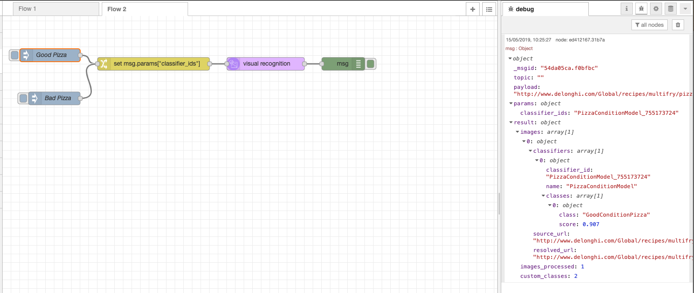

You are now ready to create your app !

What we expect from you is a web app with a ui for example like:
  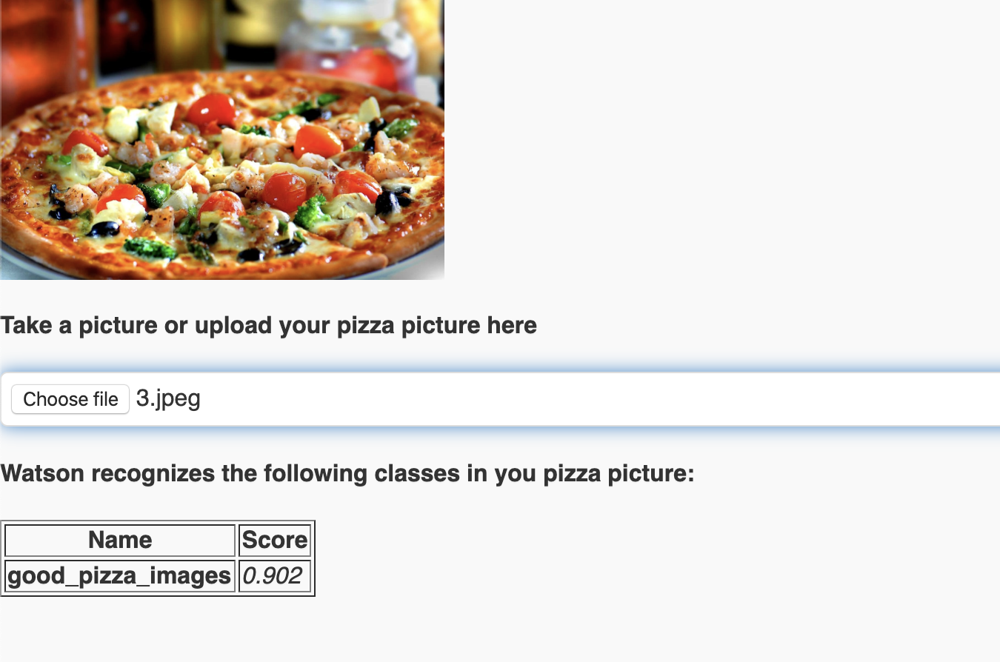

**We provide a starter code for you to help you with the integration parts**

In Node-RED you can import the starter code (menu -> import -> clipboard)
as a json object:
https://github.com/cllebrun/Node-RED-Pizza/blob/master/startercode-nodered.json

# Step 5 - Free creative part

**What we expect form you now:**

- improve the UI
and/or
- add new features

Your job now is to plan and organise new features improvement to develop on the app.
What is the future development effort ?
What can you already implement today?
How do you organise using AGILE methodology?

We expect form you at the end of the day to provide a version 2 of the starter app and also to describe the future improvements you did not had the time to implement today.

For that, you can use HTML etc in the templates nodes, use new nodes, uses example of open sources flows as an inspiration: https://flows.nodered.org/

**Tips for Node-RED usage:**
- Use the "Info tab" for each node, when you select it in Node-RED to better understand input/output and parameters:

  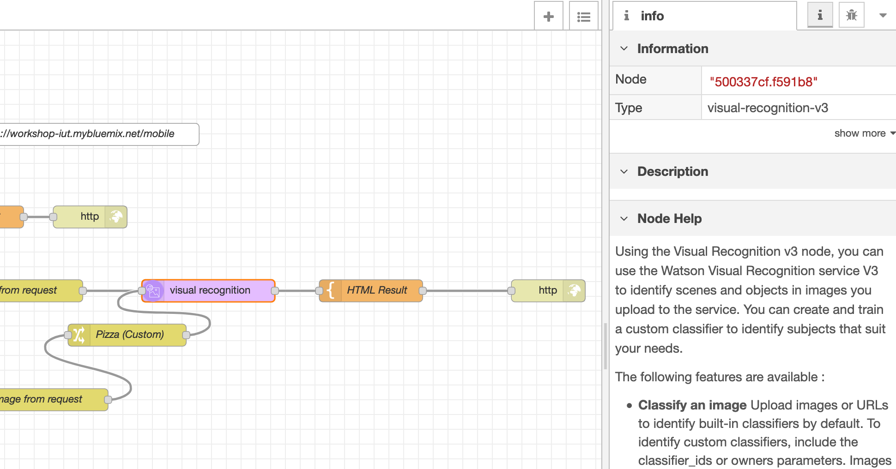

- To import new libraries of nodes that you can find on https://www.npmjs.com
In your Node-RED app go to Menu -> Manage Palette -> Onglet "Install"
  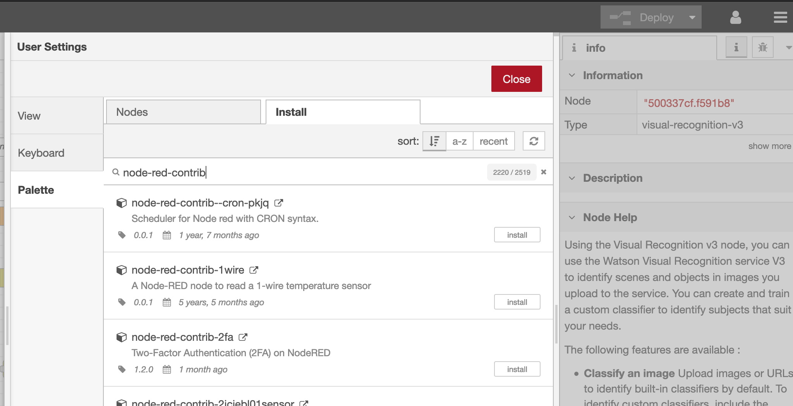
